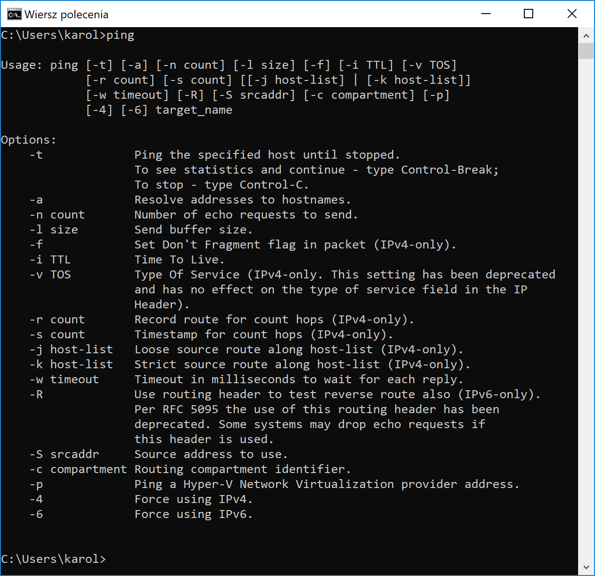

# Szkolenie z protokołu HTTP

## Przygotowanie

1. Zainstalowanie oprogramowania opisanego poniżej
2. Posiadanie konta na github.com
3. Dobry humor :)

## Oprogramowanie

Aby móc skorzystać ze szkolenia w pełni, będzie potrzebne dodatkowe oprogramowanie.
W wielu przypadkach potrzebny program jest domyślnie zainstalowany na danym systemie.

### Ping

Ping służy do sprawdzenia połączenia z wybranym serwerem.
Należy pamiętać że niektóre serwery mają wyłączone odpowiadanie na dane pochodzące z tego narzędzia, co może dać złudne przekonanie że nie mamy połączenia.

#### Instalacja

**Ping jest zazwyczaj zainstalowany domyślnie w systemie.**

#### Sprawdzenie

Wpisz w wierszu polecenia (Windows) lub terminalu (Linux/Mac) `ping`.

### cURL

Klient pozwalający na komunikację z serwerami używając różnych protokołów - FTP, HTTP, HTTPS, SMTP i wiele innych.
Szeroki wybór opcji czyni z niego dość złożone narzędzie do komunikacji.

#### Instalacja

* **Windows:** jeżeli masz zainstalowany Git Bash, masz także cURL. W innym wypadku prawdopodobnie będzie trzeba zainstalować narzędzie.
* **Linux i Mac:** zazwyczaj narzędzie jest zainstalowane domyślnie.

Informacje dotyczące instalacji i użycia [tutaj](software/curl.md).

#### Sprawdzenie

Wpisz w wierszu polecenia (Windows) lub terminalu (Linux/Mac) `curl --version`.

### Traceroute

Narzędzie badające trasę jaką przebywają dane do wskazanego serwera.

#### Instalacja

* **Windows:** traceroute jest domyślnie zainstalowany w systemie Windows, dostępny pod nazwą `tracert`.
* **Linux/Mac:** należy zainstalować narzędzie.

Informacje dotyczące instalacji i użycia [tutaj](software/traceroute.md).

#### Sprawdzenie na Windows

Wpisz w wierszu polecenia `tracert pl.wikipedia.org`.

### Postman

Dość rozbudowane narzędzie służące do komunikacji z API wystawionymi na protokole HTTP.
Poza wysyłaniem zapytań HTTP w różnych wariantach, pozwala na zarządzanie API, tworzenie zestawów testów, mockowanie serwerów.

Informacje dotyczące instalacji [tutaj](software/postman.md).

### Wireshark

Wireshark to oprogramowanie pozwalające na nasłuchiwanie i przechwytywanie pakietów.
W praktyce oznacza to że można "podsłuchiwać" komunikację sieciową. 

Informacje dotyczące instalacji [tutaj](software/wireshark.md).