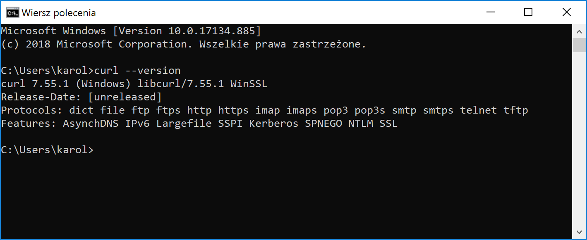
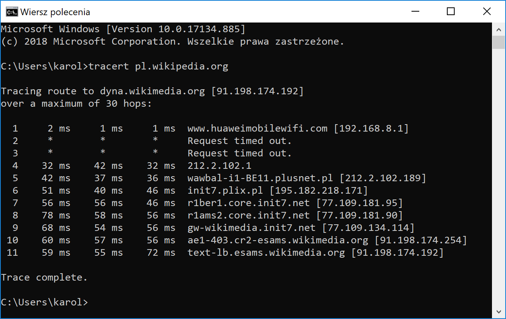

# Szkolenie z protokołu HTTP

## Przygotowanie przed szkoleniem

1. Zainstalowanie oprogramowania opisanego poniżej
2. Posiadanie konta na github.com
3. Dobry humor :)

## Oprogramowanie

Aby móc skorzystać ze szkolenia w pełni, będzie potrzebne dodatkowe oprogramowanie.
W wielu przypadkach potrzebny program jest domyślnie zainstalowany na danym systemie.

### Ping

Ping służy do sprawdzenia połączenia z wybranym serwerem.
Należy pamiętać że niektóre serwery mają wyłączone odpowiadanie na dane pochodzące z tego narzędzia, co może dać złudne przekonanie że nie mamy połączenia.

**Ping jest zazwyczaj zainstalowany domyślnie w systemie.**

Sprawdzenie ping - wpisz w wierszu polecenia (Windows) lub terminalu (Linux/Mac) `ping`.

### cURL

Klient pozwalający na komunikację z serwerami używając różnych protokołów - FTP, HTTP, HTTPS, SMTP i wiele innych.
Szeroki wybór opcji czyni z niego dość złożone narzędzie do komunikacji.

**Jeżeli masz zainstalowany Git Bash na komputerze, masz także cURL.**

Sprawdzenie czy masz cURL - wpisz w wierszu polecenia (Windows) lub terminalu (Linux/Mac) `curl --version`.

Informacje dotyczące instalacji [tutaj](software/curl.md)

### Traceroute

Narzędzie badające trasę jaką przebywają dane do wskazanego serwera.

Informacje dotyczące instalacji i użycia [tutaj](software/traceroute.md)

### Wireshark

Wireshark to oprogramowanie pozwalające na nasłuchiwanie i przechwytywanie pakietów.
W praktyce oznacza to że można "podsłuchiwać" komunikację sieciową. 

Informacje dotyczące instalacji [tutaj](software/wireshark.md)

### Postman

Dość rozbudowane narzędzie służące do komunikacji z API wystawionymi na protokole HTTP.
Poza wysyłaniem zapytań HTTP w różnych wariantach, pozwala na zarządzanie API, tworzenie zestawów testów, mockowanie serwerów.

Informacje dotyczące instalacji [tutaj](software/postman.md)