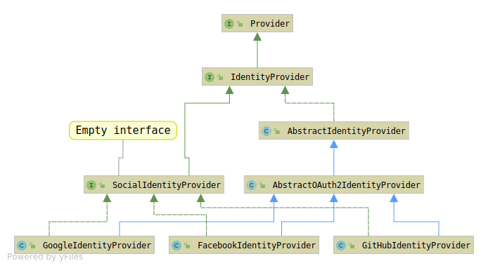

# Abstract Class Compared to Interfaces

Similarities:
* Cannot be instantiated.
* May contain a mix of methods declared with or without an implementation.

In abstract class:
* You can declare fields that are not static and final.
* You can define public, protected and private concrete methods.

In interface:
* All fields are automatically public, static and final.
* All methods that are declared or defined (as `default`) are public.
* `Since Java 9` you can declare private default methods.

**You can extend only one class; you can implement many interfaces.**

When to use abstract class:
* Sharing code between two **closely related classes**.
* Declaring non-static and non-final fields.
* Classes that extend the abstract class have many common methods or fields.
* Classes that extend the abstract class require access modifiers other than public (eg. protected, private).

When to use interface:
* **Unrelated classes** would implement the interface (eg. `Comparable` and `Cloneable`);
* Specifying a behavior but not thinking about who implements it.
* Enabling multple inheritance of type.

## Example from Keycloak

* Concrete identity providers (there are only a few on the diagram) extend the `AbstractOAuth2IdentityProvider` - their behavior is strictly related.
* `SocialIdentityProvider` is an empty interface extending `IdentityProvider` to mark identity providers that are based on social network pages.
