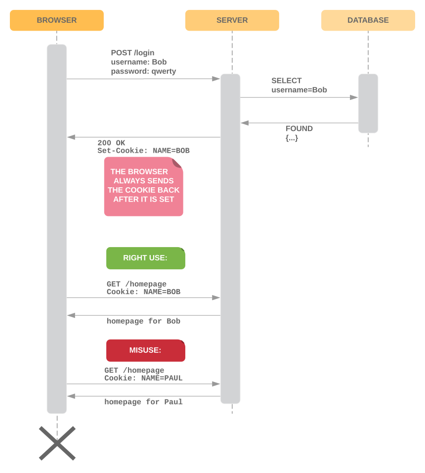
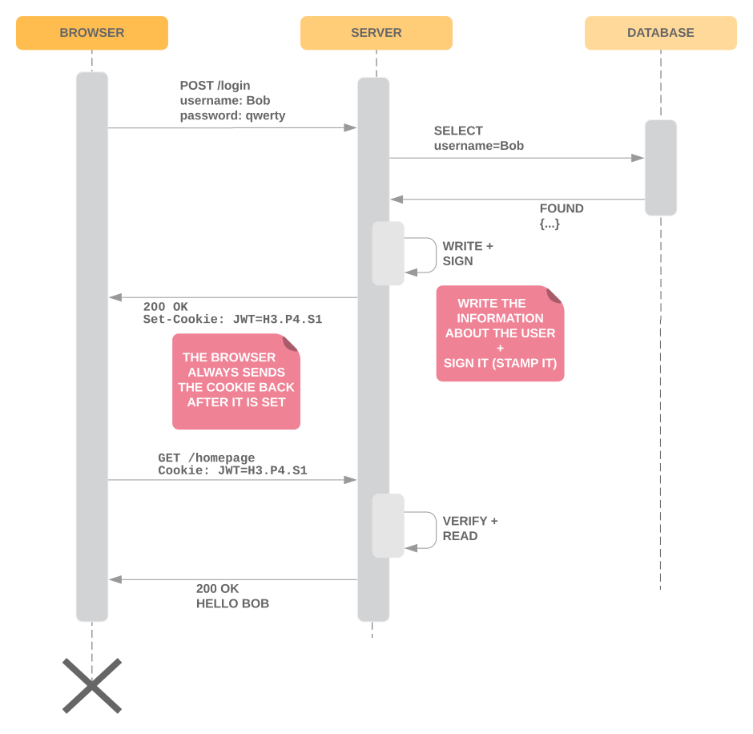

# JSON Web Tokens

## Before JWT

### Step 1 - Netscape, HTTP cookies



* The server sets the cookie with user name in the browser.
* The browser just sends the cookie back each time.
* Potential misuse - the server does not have any way to trust what it receives. It can easily be tricked into thinking that the person i

### Step 2 - session identifiers


* The session ID is transformed into user data by third-party service (`memory` on diagram).
* If there are many servers behind the load balancer, each server has its own memory and session IDs are not shared.

Resolutions for many server issue:
* Shared cache - it works, but it is a single point of failure, all requests go the same way.
* Distributed cache - better than the shared cache. However, this can be a problem in many organizations.
* Sticky sessions - in the load balancer, each session is linked with one node. This way, it knows about all required session IDs.

Usually we use two solutions at a time - sticky sessions and distributed cache.

## JWT Mechanism

* This is the third step in the way described above.
* **This is a specification, a standard, therefore it can be used with any language.**
* **Instead of storing the information at the server side, do it on the client side!**
* **There is no platform of comparison between JWT and Cookies or between JWT and OAUTH2!**
* **In its basic form, it is stateless.**
* JWT can be compared to Session IDs. 
* JWT can be used using Cookies.



* Cookies are used.
* The server writes the information about the user and then signs it, to make sure it can verify it afterwards.
* THERE IS NO ENCRYPTION. The information is encoded = signed in BASE64 url-safe.

## Message parts

### 1. Header

Header claims:
* `alg` - algorithm to be used ;
* `typ` - .

### 2. Payload

Payload consists of claims. There are public claims, which have a specific meaning. The presence and contents of the public claims depends on the context. Public claims:
* `iss` - issuer - who signed the token/who printed the banknote;
* `sub` - subject - login, email or similar;
* `aus` - audience - you can target the token to specific audience;
* `exp` - expiration time - when the token will expire - a date from when the token should not be trusted;
* `nbf` - not before - this, with expiration time specifies the validity period of the token;
* `ist` - issued at.
* `jti` - JWT ID - unique id to all the generated tokens.

After these claims, there can be private claims, eg.:
* `name` - name of the user;
* `permissions` - permissions of the user.

### 3. Signature

For example, if `"alg": "HS256"` the following function will be used to generate the signature:
`hmacSha256(encodedHeader + "." + encodedPayload, "secret");`.

### Example message

#### Encoded

```
eyJhbGciOiJIUzI1NiIsInR5cCI6IkpXVCJ9
  .eyJzdWIiOiIxMjM0NTY3ODkwIiwibmFtZSI6IkpvaG4gRG9lIiwiaWF0IjoxNTE2MjM5MDIyfQ
  .SflKxwRJSMeKKF2QT4fwpMeJf36POk6yJV_adQssw5c
```

*Breaklines added to enhance readability.*
*Encoded header, encoded payload and signature are divided by the dot.*


#### Decoded

1. Header:
```json
{
  "alg": "HS256",
  "typ": "JWT"
}
```

2. Payload:
```json
{
  "sub": "1234567890",
  "name": "John Doe",
  "iat": 1516239022
}
```

3. Signature
`SflKxwRJSMeKKF2QT4fwpMeJf36POk6yJV_adQssw5c` is the output of the function:
```
HMACSHA256(
  base64UrlEncode(header) + "." +
  base64UrlEncode(payload),
  your-256-bit-secret
)
```

The resultant signature is used to trust the payload. **If anything changes in the payload, the signature will change and the server should reject the message!**

## Signing the message

There are two ways of signing the message:
* symmetric - the secret is shared among nodes/services - **not neccessarily secure**;
* asymmetric - a security provider is used with a **private key**, public key is shared.

## What about OAUTH2

OAUTH2 tokens are mostly obscure. **JWT can be used with OAUTH2**:
* it will is a bit longer;
* **it removes the neccessity to use a storing service to verify stuff**;
* **we can check the `access_token` and `refresh_token` in a completely stateless way**.

**The same with OPEN-ID connect - the `id token` is a JWT!**

## Benefits

* Minimal overhead - just add a processor to every used node to encode/decode the message.
* Microservices can be used.


## Drawbacks

### Tokens revocation

At some point you have to revoke a token, without revoking all of them.

#### Blacklisting

* have a blacklist storing all the tokens that are not supposed to pass;
* this is counterintuitive - in security you usually have a whitelist instead of it; if the blacklist fails hell opens.

### Security threats
TODO

